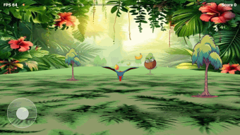

# 🦜 Parrot Runner >>
# A playable and AI platform system that builds it, Tests it with Golden sets multi Agent, agent verification  and validates it before publishing: 
# later: collects and measure real-world ad performance for impovemnt. compares to rubric score" to "variant win-rate"  ** closing the loop from production back into generation. **
# Deterministic code gates.  with Human in the loop for decisions No guessing what is not Known.:  **
# The data flywheel **

[](https://github.com/dkauzi/parrot-runner/actions/workflows/main.yml)
[](https://dkauzi.github.io/parrot-runner/)


A forward-flying parrot collecting fruit through a jungle - **built as a playable ad** - plus the

**agentic AI pipeline that generates and quality-controls its art**. 
The game is the artefact; 
The pipeline is the point.

▶️ **Play it here :** https://dkauzi.github.io/parrot-runner/ &nbsp;·&nbsp; 

📊 **Dashboard AI Pipeline Observability 
&nbsp;·&nbsp; 
** https://dkauzi.github.io/parrot-runner/dashboard.html

observability is build in from day 1:** 



---

## 🟢 Notes 

An AI **draws** each game asset (parrot, fruit, trees, jungle). Before any asset is used, automatic
checks and a second AI **grade** it; anything wrong is **regenerated**; anything uncertain goes to a
**human**. Every step is logged and shown on a live **dashboard** so anyone can see *what was made,
whether it's good, what it cost, and what needs attention* - no code required.

```
  PROMPT ─▶ 🎨 GENERATE ─▶ 🟢 VALIDATE ─▶ 🔵 JUDGE ─▶ 🔁 RETRY ─▶ 🙋 ESCALATE
           (an AI makes it)  (hard rules)  (an AI grades)  (fix & re-try)  (human decides)
```

| What | Plain meaning |
|---|---|
| 🎨 **Generate** | An AI image model paints the asset from a saved prompt. |
| 🟢 **Validate** | Code checks the basics (right format, transparent, right size). *Always runs.* |
| 🔵 **Judge** | A second AI scores it like a game designer (reads at speed? pops? on-theme?). |
| 🔁 **Retry** | If the score is low, the AI's feedback rewrites the prompt and tries again. |
| 🙋 **Escalate** | If it still can't pass, a human is asked - the AI never guesses. |

---

## 🔵 For engineers

```
src/                     the game (TypeScript + three.js, single-file playable ad)
pipeline/agentic/        the AI system
  run.mjs                orchestrator: generate → validate → grade → judge → retry → escalate
  generate.mjs           image provider adapter (Pollinations free / mock) + adaptive chroma-key
  judge.mjs              LLM judge adapter (Gemini / Claude, raw fetch, structured output)
  grade-deterministic.mjs  ALWAYS-ON deterministic grader (transparency / coverage / centering)
  rubric.mjs             one source of truth for the grading criteria
  agents.config.json     versioned config-as-data (providers, models, thresholds, prompt versions)
  eval.mjs               golden eval - guards the JUDGE against drift
  visual-eval.mjs        plays the built game, screenshots it, AI + deterministic visual QA
  visual-fix-loop.mjs    two-agent loop: judge the screenshot → regenerate → repeat
  dashboard.mjs          self-contained observability dashboard
pipeline/validate*.mjs   zero-dep asset gate + single-file build gate
prompts/*.md             prompt-as-code (versioned, diffable, rolled back via git)
```

**Run everything:**
```bash
npm install
npm start                 # dev server → http://localhost:9000
npm run ci                # 11 unit + asset gate + provenance + build + build-gate + 5 e2e
npm run pipeline          # generate + grade assets (free, offline mock by default)
node --env-file=.env pipeline/agentic/run.mjs --promote   # real AI art (Pollinations) + Gemini judge
npm run pipeline:dashboard && open pipeline/agentic/dashboard.html
npm run eval              # golden eval (judge drift)        ·  npm run eval:visual  (visual QA)
npm run capture:gif       # animated gameplay GIF for the dashboard
```

---

## 🟣 What's AI vs 🟢 what's deterministic code (the core decision rule)

> AI for **judgment/creative**; code for **deterministic** work. Knowing where *not* to use AI is the point.

| Task | Handled by | Why |
|---|---|---|
| Sprite & background **art** | 🟣 AI | creative, high-variability - taste matters |
| Asset **quality grading** | 🟣 AI judge | subjective rubric - real judgment |
| Collision, scoring, loop, **physics** | 🟢 code | must be exact, fast, identical every run |
| **Validation** gates | 🟢 code | fail-loud rules, no LLM variance |
| Background **acceptance** | 🟢 code | a backdrop that passes image checks is fine - don't over-apply AI |

---

## 🛡️ Key engineering decisions

1. **Deterministic judge always; AI is additive.** The AI grader handles taste, but a deterministic
   grader runs first and is the **fallback** when the AI is rate-limited or unsure - the system
   degrades to code, never to a guess. (This is what catches "the background isn't transparent.")
2. **Fail-loud validation at every boundary.** Bad assets are rejected and surfaced immediately
   (`validate.mjs`, `validate-build.mjs`, `grade-deterministic.mjs`), never flowed downstream.
3. **Prompt-as-code + config-as-data.** Prompts are versioned markdown; agent behaviour lives in one
   versioned `agents.config.json` (owner, last-audited, models, thresholds). Change = reviewable PR +
   git-revertable rollback. The runtime is separate from the config.
4. **Evaluate the evaluator.** A golden set of labelled assets regression-tests the *judge* itself, so
   a silent model swap that moves the quality bar is caught (`npm run eval`).
5. **Swappable adapters.** Image and judge providers are adapters - change a vendor/model in one place
   (Claude > Gemini > offline mock), never a rewrite. Free by default (Pollinations + Gemini free tier).
6. **Resilience.** Exponential backoff on 429/5xx; the pipeline never double-fires or hangs on a
   provider outage - it falls back.
7. **Observability everywhere.** Every stage is a logged span (trace id, outcome, latency). The
   dashboard reads those logs - nothing on it is hand-written.
8. **Right-sized restraint.** No agent framework for a few assets; built the high-signal pieces.
9. **Closed the loop.** Real play (`window.__telemetry`) is aggregated per variant into engagement and
   ranked, so the north-star is *which variant performs*, not just *which looks good* - the flywheel.
10. **A second validate agent checks the play experience, not just assets.** `visual-eval` plays the
    built game, screenshots real gameplay, and grades the **camera/framing** (deterministic: is the
    mid-frame mostly floor? + AI: is the bird well-framed for play?). This is what caught the
    "upside-down" camera bug that every functional test passed straight through.
11. **AI is metered.** Image gens and judge calls are counted and costed on the dashboard (free tiers →
    ~$0, but tracked so it scales honestly).
12. **Live dashboard == local.** `dashboard.html` is fully self-contained (data/images inlined), so
    Pages serves exactly what's built - `build:pages` just copies it, no browser or keys in CI.

> The hard part was never the code - it was the **judgment**: where to draw the AI/deterministic line,
> why the AI judge can't be the sole arbiter, and catching a camera bug the green tests sailed past.

---

## ✅ Testing & quality gates (every one runs in `npm run ci`, green on every push)

Layered so each catches what the layer below can't: logic, then the real built artifact, then how it
looks, then where it runs. Code measures everything measurable; the AI judge only adds taste.

| Gate | Type | Proves |
|---|---|---|
| 🟢 unit tests | deterministic | scoring & collision logic correct (11 tests) |
| 🟢 asset gate | deterministic | every sprite is a valid, transparent, in-budget PNG |
| 🟣 provenance | deterministic | each sprite is AI-generated (SHA-256 + generator), unaltered |
| 🟢 build gate | deterministic | the playable is one self-contained file, ≤5 MB, MRAID/CTA present |
| 🔵 e2e (Playwright) | functional | built game loads, loop runs, WebGL healthy, CTA fires, perspective sane (6 tests) |
| 📱 device-size QA | deterministic | renders on 6 placements (phone portrait/landscape, tablet): canvas fills, start reachable, no overflow |
| 🔵🟢 visual QA | AI + deterministic | real-gameplay screenshot graded for sprites, seams, camera & perspective; deterministic pink/floor floor |
| 🟣 golden eval | regression | guards the AI judge itself against drift (a model swap can't silently move the bar) |

Functional tests + regression are also surfaced on the dashboard (per-case pass/fail) so non-technical
stakeholders can see them re-run after every code change.

---

## 🎯 The closed loop (the data flywheel)
The rubric measures *"does the asset look good?"*. The real north-star is *"which variant **performs in
play**?"*. The game emits `window.__telemetry` (variant, score, pickups, duration) every run;
`collect-telemetry.mjs` aggregates it **per variant** into an engagement score, and the dashboard's
**"Closing the loop"** panel ranks them and recommends *which variant to generate more of*. Locally
that's Playwright runs; in production the **same shape** is fed by the ad-network's performance
webhook - so production play feeds straight back into what the pipeline generates next.

```
generate ─▶ grade ─▶ ship variant ─▶ 🎯 real-play telemetry ─▶ rank ─▶ generate more of the winner
                                          (closes here)
```

Run it: `npm run telemetry` &nbsp;then&nbsp; `npm run pipeline:dashboard`.

Run it: `npm run telemetry` &nbsp;then&nbsp; `npm run pipeline:dashboard`.

See `AGENTIC.md` (pipeline deep-dive), `ARCHITECTURE.md`, `REQUIREMENTS.md` (assignment compliance).
